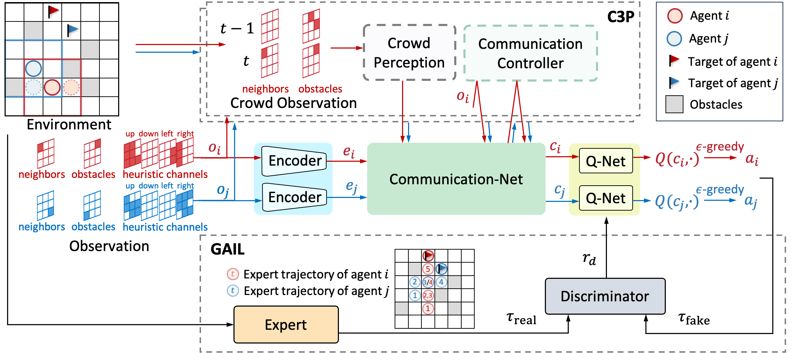

# C3PIL: Crowd Perception Communication-Based Multi-Agent Path Finding with Imitation Learning

Jing Xie, Yongjun Zhang, Huanhuan Yang, Qianying Ouyang, Fang Dong, Xinyu Guo, Songchang Jin and Dianxi Shi (Under review for RA-L)

# Model
We propose a decentralized Multi-Agent Path Finding (MAPF) method C3PIL with Crowd Perception Controlled Communication and generative adversarial Imitation Learning. Our overall model achieves a SOTA level. 

# Setup

- Clone the repository `git clone https://github.com/JingX/C3PIL.git` and move into the top level directory `cd C3PIL`.
- Create conda environment. `conda env create -f environment.yml`.
- Activate the environment. `conda activate C3PIL`.

# Compile cpp_mstar code
- cd into the `cd od_mstar3` folder. `python3 setup.pybuild_ext`.
- copy .so object from build/lib.*/ at the root of the od_mstar3 folder.
- Check by going back to the root of the git folder, running python3 and "import cpp_mstar".

# Train
- Generate the expert dataset for imitation learning `python il_data.py` and save datasets at the data folder.
- Train `python train.py` and save the model at the saved_models folder.

# Test
- Test the model in environments at the test_set folder.
- Run `python test.py`.

# Visualization
- Cancel the comment in test.py about make_animation() and run `python test.py`
- See results at the videos folder

<!-- # Cite -->

